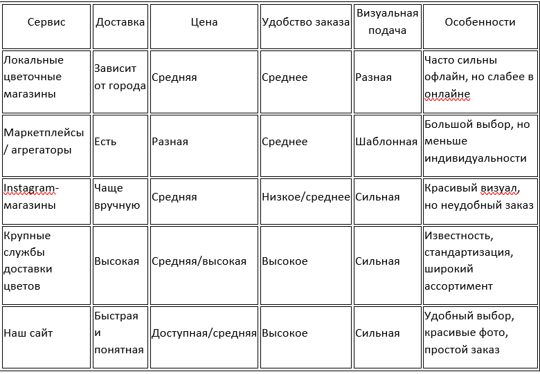

# Анализ целевой аудитории и проблем

## Демографический портрет

### Сегмент A: Молодёжь и студенты (16–22 года)
Почему 16+ — правильный фокус для MVP (минимально жизнеспособного продукта)

Причина. Пользователи 16+ уже могут самостоятельно выбирать подарки и оформлять небольшие заказы
Объяснение. Для аудитории младше 16 лет покупка цветов чаще зависит от родителей, а сама потребность в отдельном цветочном сервисе выражена слабее. Кроме того, у пользователей 16+ уже есть собственные сценарии покупки: свидания, дни рождения, праздники, извинения, знаки внимания
Что это значит для вас. Вы можете сфокусироваться на аудитории, которая уже самостоятельно принимает решение о покупке и реально пользуется услугой

Причина: Платёжеспособность и монетизация
Объяснение. У аудитории 16–22 лет бюджет ограничен, поэтому для них особенно важны доступные букеты, акции и понятные цены. Они реже готовы переплачивать за сложные композиции, но охотно покупают недорогие и визуально привлекательные варианты
Что это значит для вас. На старте стоит делать упор на доступный ассортимент, акции, небольшие букеты и простые предложения под конкретный повод

Причина: Продуктовая фокусировка
Объяснение. Потребности подростков и студентов отличаются от потребностей более взрослой аудитории. Молодым пользователям важны внешний вид букета, скорость выбора, простое оформление заказа и удобная доставка
Что это значит для вас. Это позволяет создать понятный сервис с простым каталогом, быстрым выбором и удобным оформлением заказа без перегруженного интерфейса

Как корректно охватить более молодую аудиторию:
- поэтапная стратегия

Вы не отказываетесь от этой аудитории, а откладываете прямой акцент на неё до следующего этапа развития

Этап 1 (запуск MVP): ядро — 16–35 лет. Упор на удобный каталог, понятные цены, красивые фото и быструю доставку
Этап 2 (масштабирование): внедрение подарочных сертификатов, акций и специальных предложений для повторных клиентов
Этап 3 (расширение): развитие бюджетных подборок, сезонных решений и подарочных наборов для более широкой аудитории

Проблемы текущих решений:
- Сложно быстро выбрать подходящий букет
- Непрозрачные цены и скрытые доплаты
- Слабый визуальный каталог
- Неудобный и долгий процесс заказа

### Сегмент B: Молодые специалисты (23–35 лет)

Поведенческие характеристики:
- Покупают цветы на праздники, встречи, свидания и семейные события
- Готовы платить за качество и удобство
- Ценят экономию времениЧасто оформляют заказы с телефона
- Обращают внимание на надёжность сервиса и качество доставки

Проблемы текущих решений:
- Шаблонный ассортимент
- Сложный или перегруженный интерфейс сайта
- Неудобные фильтры и поиск
- Недостаток доверия из-за слабых фото и отзывов

### Психографические характеристики
Общие для всей аудитории:
- Ценностный драйвер: желание подарить эмоции, внимание и заботу
- Боль: сложно быстро найти красивый букет под конкретный повод и бюджет
- Мотивация: оформить заказ быстро, удобно и без риска ошибиться
- Страхи: переплатить, получить букет хуже, чем на фото, или столкнуться с проблемами при доставке

Ключевые инсайты:
- «Я не знаю, какой букет выбрать» — нужна помощь в выборе
- «Хочу красиво, но не слишком дорого» — важен баланс цены и внешнего вида
- «Мне нужно быстро оформить заказ» — нужен короткий путь к покупке
- «Хочу быть уверенным, что букет будет как на фото» — нужен высокий уровень доверия

### География охвата
Приоритет 1: РФ
- Основной рынок с высоким спросом на доставку цветов
- Высокая популярность онлайн-заказов
- Важность локальной доставки и скорости обработки заказа
- Повышенный спрос в праздничные даты

Приоритет 2: СНГ (Казахстан, Беларусь)
- Схожие сценарии покупки
- Близкие ожидания аудитории
- Возможность масштабировать готовую модель на соседние рынки

### Методы валидации гипотез
Качественные:
- Глубинные интервью с клиентами
- Анализ поведения пользователей на сайте
- Изучение отзывов о конкурентах и комментариев в соцсетях

Количественные:
- Онлайн-опросы
- Анализ поисковых запросов
- Тестирование прототипов каталога, карточек товара и корзины

### Продукт: технологии и удобства
 Ядро удобства пользователя
1. «Умный» старт
Проблема: Новым пользователям сложно быстро сориентироваться в ассортименте
Наше решение:
- Подбор по поводу: «На день рождения», «Для любимой», «Для мамы», «На свадьбу», «Просто так»
- Фильтры: по цене, цвету, составу и формату букета
- Готовые подборки: «До 2000 ₽», «Популярные», «Нежные», «Яркие», «Праздничные»

2. Бесшовный интерфейс
Принципы проектирования:
- Быстрый просмотр каталога
- Минимум шагов до заказа
- Адаптация под смартфоны
- Понятная навигация
- Прозрачные цены и условия доставки

3. Контекстный выбор
Умные режимы:
- По событию: день рождения, юбилей, свидание, свадьба
- По получателю: девушке, маме, коллеге, подруге
- По бюджету: недорогие, средние, премиальные
- По стилю: нежные, яркие, минималистичные, праздничные

Технологические инновации
1. Персонализированные рекомендации
Отличия от конкурентов:
- Рекомендации на основе просмотров и заказов
- Подбор похожих букетов по стилю и цветовой гамме
- Сезонные подборки
- Подсказки: «Этот букет часто выбирают на день рождения», «Подходит для романтического повода»

2. Социальный слой
Интеграции:
- Telegram-бот: быстрый переход к каталогу, акциям и заказу
- VK-сообщество: новинки, отзывы и специальные предложения
- Функция «Поделиться букетом»: возможность отправить ссылку на выбранный букет другому человеку

3. Сервисные технологии
Качество сервиса:
- Понятная форма заказа
- Уведомления о статусе доставки
- Выбор даты и времени
- Обратная связь
- Актуальная информация о наличии товаров

### Уникальные функции MVP
Приоритет 1 (запуск):
- Подборки по поводу
- Фильтрация по цене, цвету и составу
- Карточки товаров с понятными фото и описанием
- Быстрое оформление заказа
- Блок популярных букетов
- Прозрачная информация о доставке и оплате

Приоритет 2 (3–6 месяцев):
- Персональные рекомендации
- Подарочные сертификаты
- Отзывы с фото
- Сезонные подборки
- Акции для повторных клиентов

Приоритет 3 (6–12 месяцев):
- Конструктор букета
- Подписка на регулярную доставку цветов
- Корпоративные заказы
- Партнёрства с кондитерскими и подарочными сервисами
  
## Удобство в цифрах
### Удобство для сегмента А: Студенты (16–22 года)

Их ключевой драйвер — доступность, простота выбора и эмоциональная покупка

Их проблема: высокая чувствительность к цене
Конкретное удобство в сервисе: доступные букеты, акции и понятные цены
Как это реализовать в продукте: разделы «До 1500 ₽» и «До 2000 ₽», скидка на первый заказ, специальные предложения к праздникам

Их проблема: сложно выбрать букет
Конкретное удобство в сервисе: быстрый подбор по поводу
Как это реализовать в продукте: категории «Для девушки», «Для мамы», «На день рождения», «На свидание»

Их проблема: недостаток доверия
Конкретное удобство в сервисе: прозрачная визуальная подача
Как это реализовать в продукте: реальные фото букетов, отзывы клиентов, понятные описания состава

Их проблема: неудобный заказ
Конкретное удобство в сервисе: короткий путь к покупке
Как это реализовать в продукте: упрощённая корзина, минимум шагов до оплаты, адаптация под мобильные устройства

### Удобство для сегмента Б: Молодые специалисты (23–35 лет)

Их ключевой драйвер — качество, удобство и экономия времени

Их проблема: нет времени долго выбирать
Конкретное удобство в сервисе: готовые подборки и быстрый выбор
Как это реализовать в продукте: букеты по поводам, популярности и ценовому диапазону

Их проблема: шаблонный ассортимент
Конкретное удобство в сервисе: более точные рекомендации
Как это реализовать в продукте: предложения похожих букетов по стилю, цвету и назначению

Их проблема: недостаток доверия
Конкретное удобство в сервисе: прозрачность сервиса
Как это реализовать в продукте: информация о доставке, оплате, составе и сроках

Их проблема: сложный интерфейс
Конкретное удобство в сервисе: минимализм и скорость
Как это реализовать в продукте: понятный каталог, быстрые фильтры, удобное оформление заказа с телефона

### Анализ конкурентов и обоснование решений
Сравнительная таблица конкурентов

### Обоснование пробного периода
Почему клиент должен выбрать именно наш сервис?
Экономическая эффективность:
- Понятные цены без скрытых доплат
- Быстрый путь от выбора до заказа
- Возможность подобрать букет под нужный бюджет

Психологический эффект:
- Красивый и понятный каталог снижает сомнения
- Прозрачные условия повышают доверие
- Реальные фото и отзывы помогают быстрее принять решение

Дифференциация:
- Упор на удобство выбора
- Подбор букетов по поводу, получателю и бюджету
- Сочетание визуальной привлекательности и простого оформления заказа

### Ценовая стратегия
Базовый сегмент:
- Доступные букеты для повседневных и спонтанных покупок
- Подходит для студентов и молодой аудитории
- Акцент на сочетание красоты и доступной цены

Средний сегмент:
- Букеты для праздников, свиданий, дней рождения и поздравлений
- Основной источник заказов
- Баланс цены, качества и внешнего вида

Премиальный сегмент:
- Более дорогие композиции, большие букеты, праздничные и свадебные решения
- Ориентир на клиентов, готовых платить за впечатление и сервис
- Возможность увеличить средний чек

### Анализ трендов рынка
Глобальные тренды:
- Рост онлайн-заказов и доставки
- Визуальность как главный фактор выбора
- Персонализация предложений
- Упрощение мобильного оформления

Локальные особенности РФ/СНГ:
- Высокий спрос в праздничные даты
- Важность локальной доставки день в день
- Чувствительность к цене
- Большое значение реальных фото и отзывов